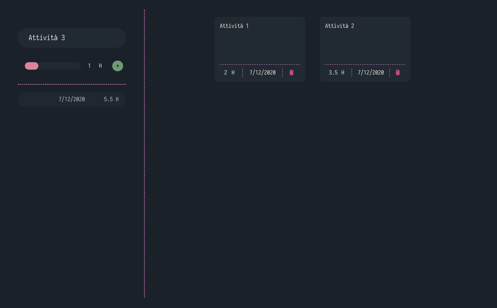

# TrackerBT

[](https://codeclimate.com/github/NespoliBT/TrackerBT/maintainability)


## Description

TrackerBT is a simple time tracker. It helps you trace how much time you spend on your projects.

## Screenshot




## Installation

### Dependencies
To install the dependencies you need to run this command:<br>
```ps
npm install
```
or 
```ps
yarn
```

### Build frontend
This project uses webpack to build the frontend side of the app.
To build the frontend run this command:<br>
```ps
npm run watch
```

### Start
To run this project you need to run this command:<br>
```ps
npm run start
```

### Build release
To build a standalone release that does not need npm or node to run:

```ps
npm run build
```
